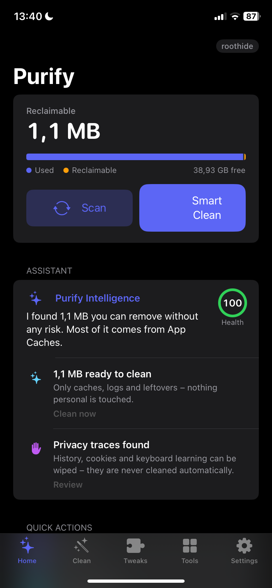
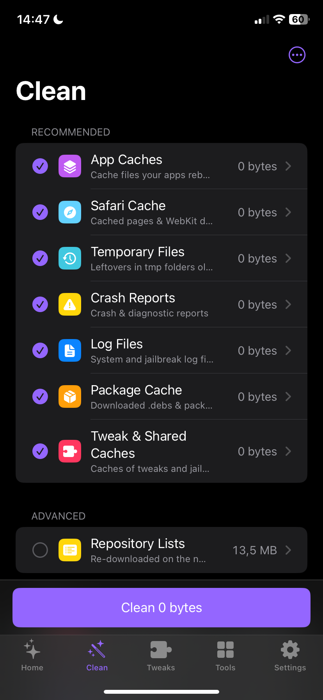
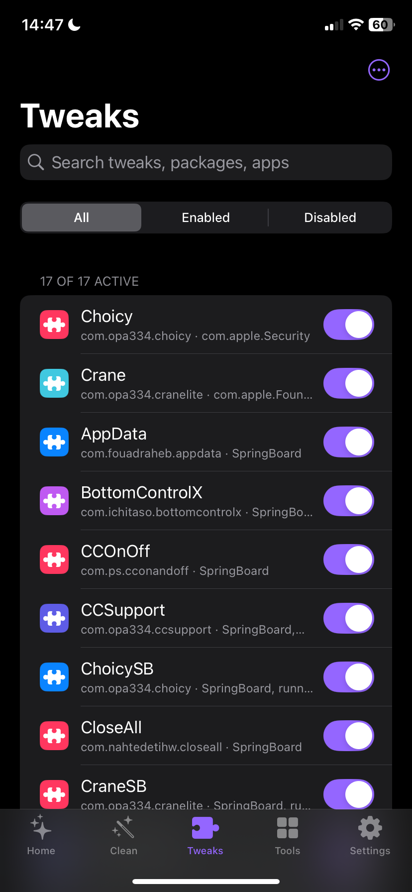
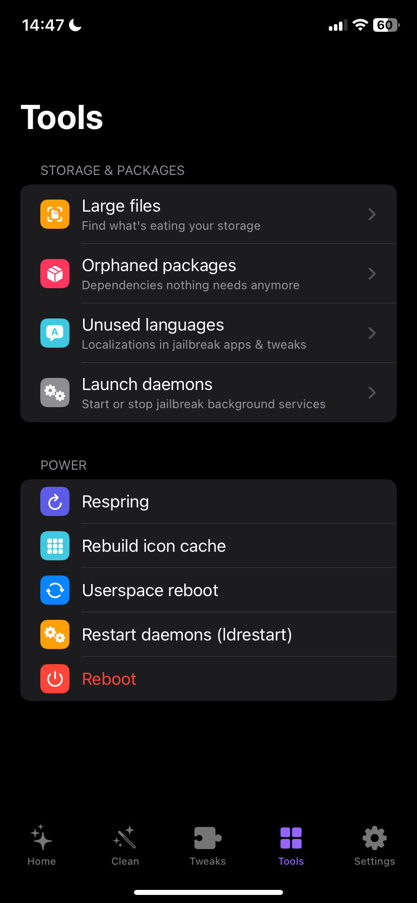
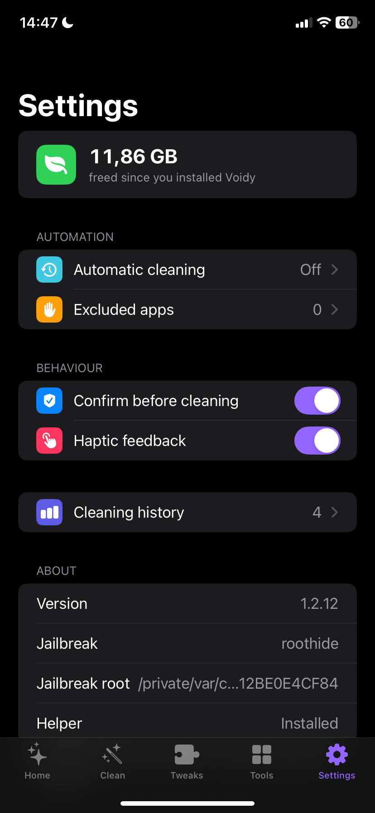

<p align="center"></p>

<h1 align="center">Voidy</h1>

<p align="center">
A lightweight system cleaner for <b>rootless</b> and <b>roothide</b> jailbreaks.<br>
Native, minimal iOS design in light and dark mode.
</p>

<p align="center">
<a href="../../releases/latest"><b>Download the latest release</b></a>
</p>

---

## Contents

- [Screenshots](#screenshots)
- [Features](#features)
- [Requirements](#requirements)
- [Installation](#installation)
- [Building](#building)
- [Project layout](#project-layout)
- [Safety](#safety)
- [Uninstalling](#uninstalling)
- [Changelog](CHANGELOG.md)

## Screenshots

<p align="center">
  
  
  
  
  
</p>

<p align="center"><sub>Home · Clean · Tweaks · Tools · Settings</sub></p>

## Features

### Cleaning

| Category | Level | What gets removed |
|---|---|---|
| App caches | Recommended | `Library/Caches` of installed apps (individual apps can be excluded) |
| Safari cache | Recommended | Browser and WebKit caches |
| Temporary files | Recommended | tmp folders of the system, the jailbreak and apps (older files only) |
| Crash reports | Recommended | Crash and diagnostic reports |
| Log files | Recommended | System and jailbreak logs (folders are kept) |
| Package cache | Recommended | Downloaded `.deb` archives and package manager caches |
| Tweak caches | Recommended | Caches of tweaks and jailbreak apps |
| Repository lists | Advanced | Package lists, re-downloaded on the next refresh |
| Browsing history | Privacy | History and recently closed tabs |
| Cookies & website data | Privacy | Cookies and stored website data |
| Keyboard learning | Privacy | Learned word suggestions |

Privacy categories always need an extra confirmation and are never cleaned automatically.

### Smart Insights
After every scan Voidy reviews the results on the device. No data is sent anywhere.
- Health score from 0 to 100
- Detects processes that crash repeatedly and points you to your tweaks
- Flags apps with very large caches (e.g. offline music) and offers to exclude them
- Warns when storage is almost full

### Tweaks
- Every installed tweak with its package and target apps
- Search and filter (all / enabled / disabled)
- Toggle tweaks on and off without deleting anything
- **Disable all** for troubleshooting and **Restore** with a single tap

### Tools
- **Large files**: find them and delete with a swipe
- **Orphaned packages**: remove unused dependencies (`apt-get autoremove`)
- **Unused languages**: remove localizations from jailbreak apps and tweaks
- **Launch daemons**: start and stop jailbreak background services
- **Power**: respring, rebuild icon cache, userspace reboot, ldrestart, reboot

### More
- **Automatic cleaning** in the background (every 6 hours up to weekly)
- **History** of all cleans with a chart
- **Home screen quick actions**: Smart Clean and Respring
- English and German

## Requirements

- iOS 15 or later
- A **rootless** or **roothide** jailbreak with a package manager (Sileo, Zebra or similar)

Sideloading only the `.app` is not enough: Voidy needs its root helper, which is installed with the package.

## Installation

1. Download the matching file from the [release page](../../releases/latest):

   | File | Jailbreak |
   |---|---|
   | `voidy_<version>_rootless_iphoneos-arm64.deb` | rootless |
   | `voidy_<version>_roothide_iphoneos-arm64e.deb` | roothide |

2. Open the `.deb` with Sileo, Zebra or Filza and install it.
3. Launch Voidy from the home screen.

## Building

You need [Theos](https://theos.dev) with Swift support (easiest on macOS with Xcode). For roothide, use the
[roothide fork of Theos](https://github.com/roothide/theos).

```sh
# rootless
make package FINALPACKAGE=1 THEOS_PACKAGE_SCHEME=rootless

# roothide
make package FINALPACKAGE=1 THEOS_PACKAGE_SCHEME=roothide THEOS=/path/to/roothide-theos
```

Packages end up in `packages/`.

### Automatic builds & releases

Every push runs `.github/workflows/build.yml`, which:

1. builds the rootless and roothide variants on macOS,
2. uses the version from `control` (e.g. `1.0`),
3. publishes both `.deb` files as GitHub release `v<version>` and removes older releases.

To ship a new version, raise `Version:` in `control`. Pull requests are built but not released.

## Project layout

```
app/                 SwiftUI app
  Sources/           UI, data model, insight rules
  Resources/         Info.plist, icons, translations
voidyhelper/        Root helper (Objective-C), replies with JSON
layout/DEBIAN/       Install and uninstall scripts
control              Package metadata
CHANGELOG.md         Release history
```

**How the app and the helper work together:** the app itself has no root privileges. For every action it launches
`voidyhelper` as root and reads its JSON reply. The helper determines the jailbreak root at runtime from its own
location, so the same code runs on rootless (`/var/jb`) and roothide.

## Safety

- The helper only accepts calls from root or from the installed Voidy app.
- Files are only removed from clearly defined locations. Photos, messages, contacts, keychain, mail,
  preferences and the package database are protected.
- Core jailbreak services cannot be turned off in the daemon list.
- Tweaks are only disabled (their filter file is renamed), never deleted.

As with any jailbreak tool: use at your own risk.

## Uninstalling

When the package is removed, Voidy automatically
- re-enables every tweak and daemon it disabled, and
- removes the automatic cleaning schedule.
